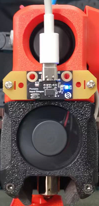
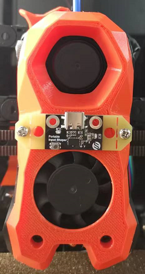

# Portable Input Shaper


## The start

Realize the idea of Nero3D of this video: https://www.youtube.com/watch?v=W_VHbT_tsZw, thanks for his sharing.

## Advantage

1. Base on popular RP2040 chip

2. Portable and you can use it on multiple Klipper firmware based 3D printer with same configuration file. Save your time.

3. Size is small and easy to dock on print head(AfterBurner, StealthBurner or even other print head) as we designed different holes on it with essential fasteners for you to install it on print head. 

4. USB-C port

## Installation

There are different screw bag for Afterburner and Stealthburner, check the mark on the bag. And install them to print head like below, and you need a USBC cable to connect it to your RaspberryPi.

| Afterburner          | Stealthburner                                             |
| -------------------- | --------------------------------------------------------- |
|  |  |

## Firmware

Follow the instruction [Measuring Resonances - Klipper documentation](https://www.klipper3d.org/Measuring_Resonances.html). But use the `PIS.cfg` config file instead. You can remove PIS after you get the [input_shaper] section parameter.

### menuconfig

Compile Klipper with following configuration.

 

### Flash firmware

1. Press and hold the button

2. Connect it to your PC with USB-C cable

3. Release the button

4. Folder named RPI-RP2 popup, copy the klipper.uf2 to the folder

5. Wait for several seconds, when finished folder will closed automatically

6. Done

### config

Use `PIS.cfg` in the repository, and add it to your `printer.cfg` by

```
[include PIS.cfg]
```

### Others

Connect RaspberryPi and PIS with USB-C cable and get the id by `ls /dev/serial/by-id` after you flashed the firmware. Refer to instruction [Measuring Resonances - Klipper documentation](https://www.klipper3d.org/Measuring_Resonances.html) if you not understand.

## Attention

Make sure you flash PIS the same Klipper version as your machine. I recommend you update Klipper to latest version. 
